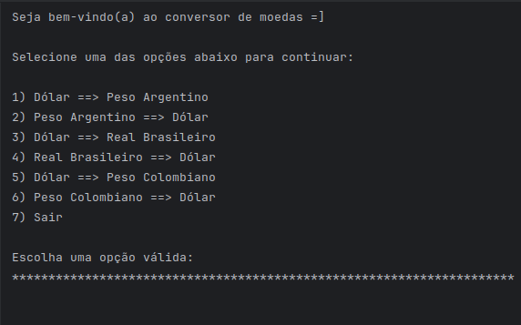

# 👋 Sejam bem-vindos ao projeto de Conversor de Moedas

O programa funciona com **6 opções de conversão**:

Após escolher a opção desejada, o sistema solicita o **valor a ser convertido** e retorna o resultado com base na **cotação atual** da moeda, utilizando a API da [ExchangeRate](https://www.exchangerate-api.com).

Esse processo acontece em **loop**, até que o usuário escolha a **opção 7** para sair.

Para que o projeto funcione corretamente após clonar o repositório:

1. Na **raiz do seu projeto** (um nível acima da pasta `src`), crie um arquivo chamado: config.properties
2. Dentro desse arquivo adicione a seguinte linha: API_KEY="seu_token_vindo_da_api" (sem aspas)
3. Estou utilizando a API [ExchangeRate-API](https://www.exchangerate-api.com).  
4. Faça seu cadastro, gere seu token e insira no `config.properties`.
5. Caso queira utilizar uma outra API para conversão de moedas, fique a vontade! O projeto foi construído utilizando os princípios SOLID, então não se tem acoplamento entre as classes. Crie a classe para sua API em específico ou então edite a classe do [ExchangeRate-API].
6. Visite a pasta do projeto para clonar e testar (https://github.com/alexscarmo/challenge-ConversorMoedas_pt).
